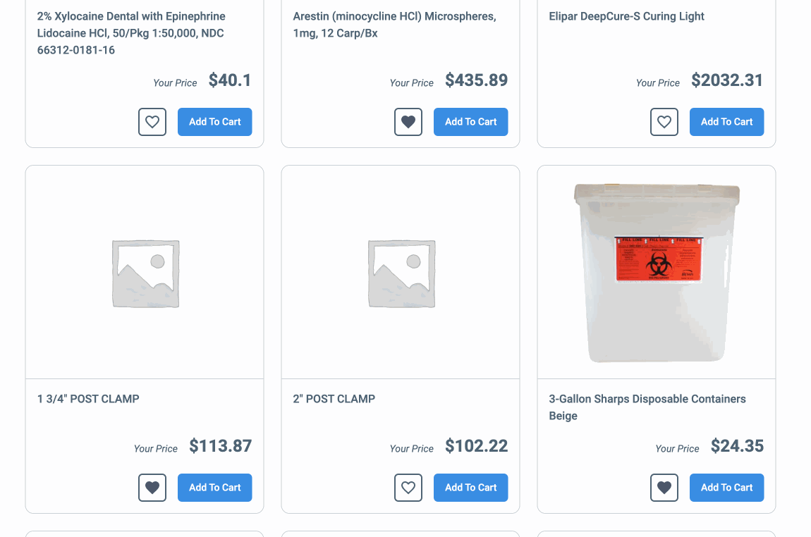

# Code Challenge with React

## Prerequisites

- Node installed

## 1. How to run the project

### 1.1 Fork the repo

```shell
git clone https://github.com/anamariasosam/code-challenge-react.git
```

### 1.2 Install dependencies

Install project dependencies before start

```shell
npm install
```

### 1.3 Running the app

To get the app up and running, run:

```shell
npm start
```

### 1.4 Running the tests

```shell
npm test
```

## 2. Demo

## 2.1 Add to Cart


## 2.2 See Favorites



## 2.3 See Cart items


## 2.4 Search by product name


## 2.5 Make change to product favorite status


## 2.6 Remove a product from Cart


## 2.7 Remove a product from Favorites


## 3. Architecture Implemented: Provider Pattern


## 4. Coverage


